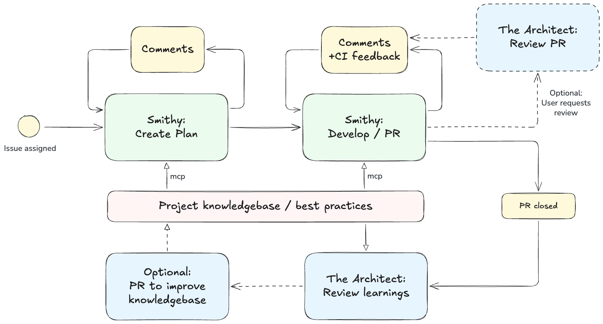
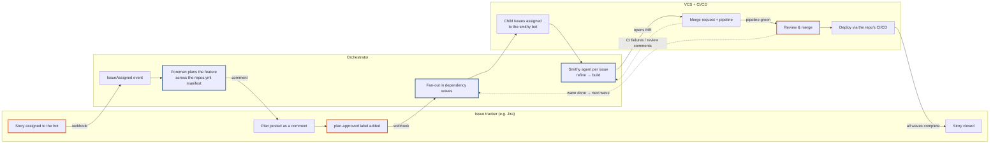

# Orchestrate Claude sessions from your issue tracker

Smithy-AI is an orchestrator for AI-assisted software development. It runs Claude Code sessions, isolated in Docker containers, with the usual planning and building phases. Optionally you can create a knowledgebase with project specific best practies and automatically review each PR against it. 

> **This project is a work in progress.** Feel free to watch the repo or open a discussion if you're interested.

## Overview

Smithy-AI coordinates multiple AI agents working alongside human developers through a GitHub, GitLab or Forgejo-based workflow:

- **Agent Smithy**: plans and implements features based on issues, creates pull requests, and responds to review feedback.
- **The Architect**: reviews pull requests against established best practices and maintains the project's knowledge base in a separate context repository.




Human actions are in yellow. The project knowledge base is an optional separate repository with markdown files used as input for best practices and preferences of the project.


### Smithy development workflow

1. Create an issue and assign to Agent Smithy
2. Smithy creates a branch, let's Claude Code write a plan and shares it with you
3. You add comments to the issue to improve the plan, once done label the issue "Plan Approved"
4. Smithy creates a draft pull-request, implements the plan, and watches CI status to validate
5. You review the issue manually or request a PR review by The Architect
6. Smithy responds to your (and The Architect's) review comments
7. You remove the Draft status of the PR, Smithy cleans up his plan and related file. Done.

### The Architect learning workflow (optional)


1. Once a PR is merged or rejected, The Architect scans the (human) review comments
2. If the knowledge base (context) requires updating based on the comments, The Architect opens a PR on the context repository
3. This PR, just like the build flow, allows you to review and request changes

### The Foreman workflow (cross-repo stories, optional)

When an issue-tracker story (a tracker key like `ECD-4309`, rather than a numeric VCS issue) is assigned to the bot, the feature-level **foreman** takes over instead of the per-issue smithy flow. It plans a feature across every repository listed in its `repos.yml` manifest, gates execution on your approval, and fans the work out to smithy agents.



Orange-bordered boxes are human actions, blue-bordered boxes are Claude agents, dashed arrows are feedback loops.

1. Assign a story to the bot. The tracker webhook delivers an `IssueAssigned` event to the orchestrator.
2. The foreman reads the story against `repos.yml` — its planning universe; only repos listed there can receive issues — and posts a cross-repo plan as a comment on the story.
3. You review the plan and approve it by adding the `plan-approved` label (or a configured status transition). Nothing executes before this gate.
4. The foreman creates child issues in the target repos, grouped into dependency waves, and assigns them to the smithy bot.
5. Each child issue runs the normal smithy workflow: a plan on the issue (auto-reviewed by the foreman), implementation, and a merge request. CI failures and review comments loop back to the owning agent.
6. As a wave's merge requests land, the foreman opens the next wave; when all waves finish, it closes the story.

## Demo setup

The `examples/demo/` directory contains a Docker Compose stack that runs a local Forgejo instance with the orchestrator.

```bash
cd examples/demo
cp .env.example .env
```

Edit .env with your CLAUDE_CODE_OAUTH_TOKEN (from `claude setup-token`)
Other fields are set automatically by the setup scripts below.

```bash
# Start the docker compose demo stack
docker compose up -d
```

Once Forgejo is running, configure it on [http://localhost:3000](http://localhost:3000) and create a repository.
Then run the scripts to configure Forgejo and the repository:

```bash
# Only the first time:
python3 scripts/setup_instance.py

# For every repository:
python3 scripts/setup_repo.py owner/repo
```

## Documentation

- **Setup**: [Demo](https://smithy-ai.github.io/smithy-ai/setup/demo/) · [GitHub](https://smithy-ai.github.io/smithy-ai/setup/github/) · [GitLab](https://smithy-ai.github.io/smithy-ai/setup/gitlab/) · [Forgejo](https://smithy-ai.github.io/smithy-ai/setup/forgejo/)
- [Usage & Workflow](https://smithy-ai.github.io/smithy-ai/usage/)
- [Configuration Reference](https://smithy-ai.github.io/smithy-ai/configuration/)
- [Custom Task Images](https://smithy-ai.github.io/smithy-ai/advanced/custom-task-images/)

## License

This project is licensed under [AGPL-3.0](LICENSE). See [CONTRIBUTING.md](CONTRIBUTING.md) for contribution terms.
