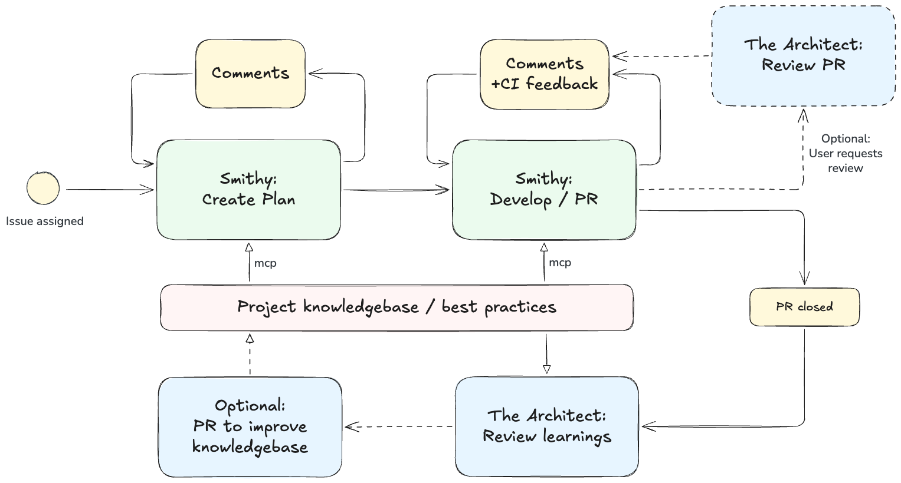

# Smithy AI

An orchestrator for AI-assisted software development. Managing planning, building, and review with autonomous Claude Code agents.

## How it works

Smithy AI coordinates multiple AI agents working alongside human developers through a Forgejo or GitLab-based workflow:

- **Agent Smithy** plans and implements features based on issues, creates pull requests, and responds to review feedback.
- **The Architect** reviews pull requests against established best practices and maintains the project's knowledge base in a separate context repository.

Human actions are shown in yellow. The project knowledge base is an optional separate repository with markdown files used as input for best practices and preferences of the project.

## Quick links

- **Setup**: [Local Demo](setup/demo.md) · [Forgejo](setup/forgejo.md) · [GitLab](setup/gitlab.md)
- **[Usage & Workflow](usage.md)**: How to use Smithy-AI day-to-day
- **[Configuration Reference](configuration.md)**: All environment variables and settings
- **[Custom Task Images](advanced/custom-task-images.md)**: Build your own agent container images
